## Frontend Challenge Calendar: 30 Days of HTML, CSS and JavaScript

This is a 30-day project to practice and improve my HTML, CSS and JavaScript skills. Throughout this calendar, I will be doing 30 different challenges to explore various concepts and basic web development techniques. 

The practice calendar was made by Pau Zuffinetti. 
[Calendar in Canva](https://www.canva.com/design/DAGKB9Ndf7E/9DKa5mmAbDOkD-04pH-x7A/edit)

### Resources 

- [HTML Documentation](https://developer.mozilla.org/es/docs/Web/HTML)
- [CSS Documentation](https://developer.mozilla.org/es/docs/Web/CSS)
- [JS Documentation](https://developer.mozilla.org/es/docs/Web/JavaScript)

### Challenges 
- [x] Simple landing page
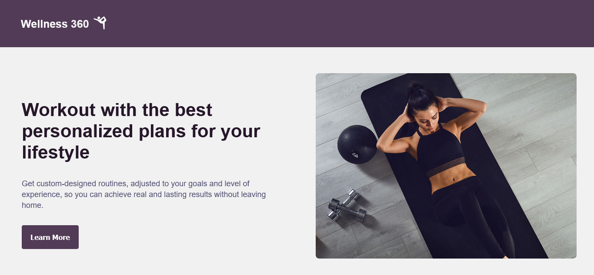
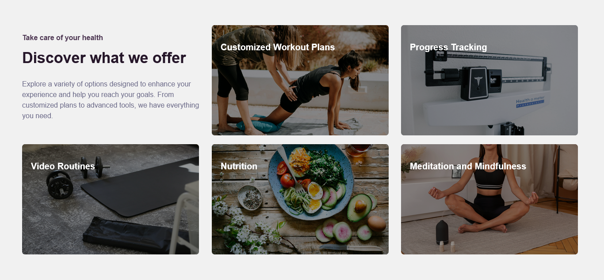

- [x] Business card
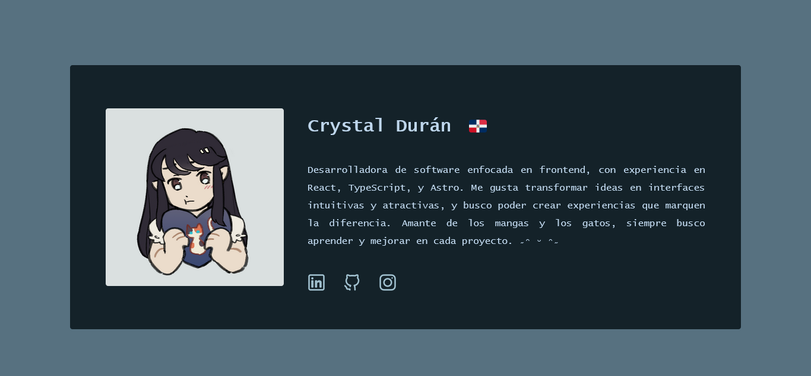
  
- [x] Navigation menu
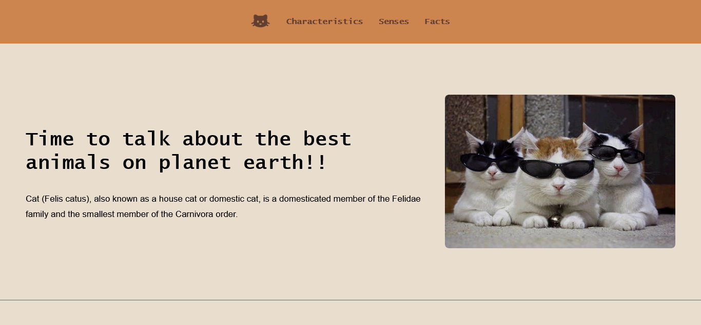

- [x] Contact form
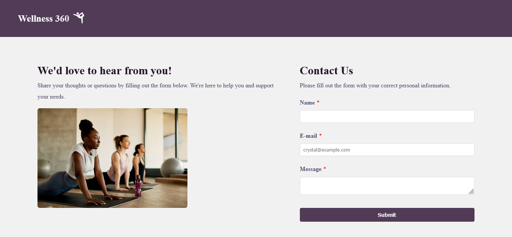
    
- [x] Pricing/plans page
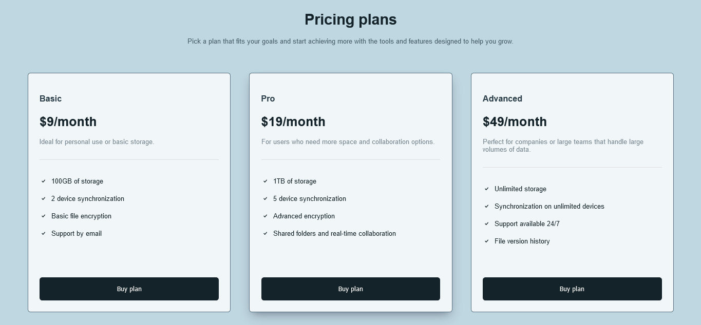

- [x] Blog
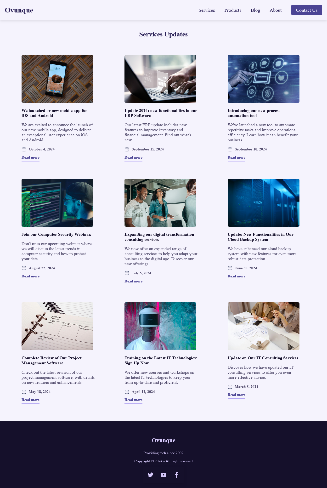

- [x] Digital clock
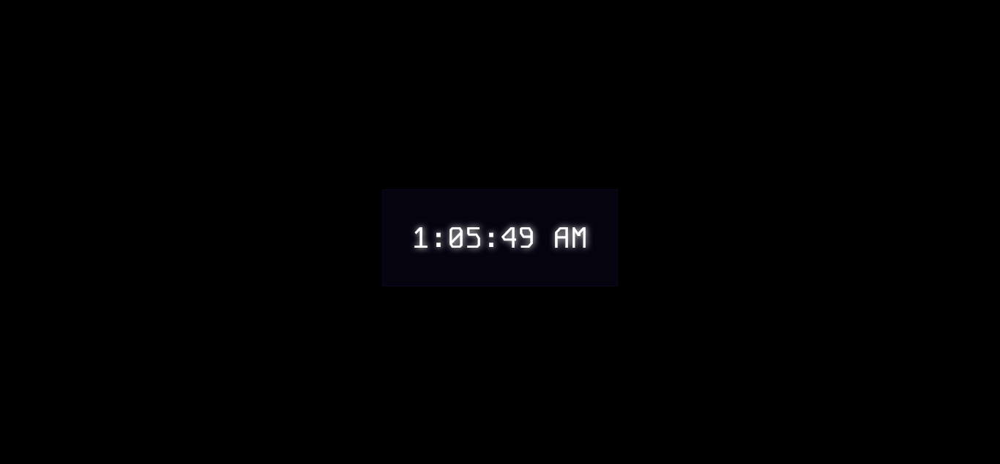

- [x] To-do list
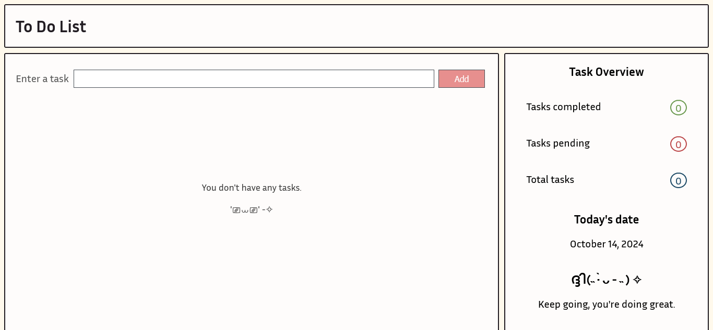
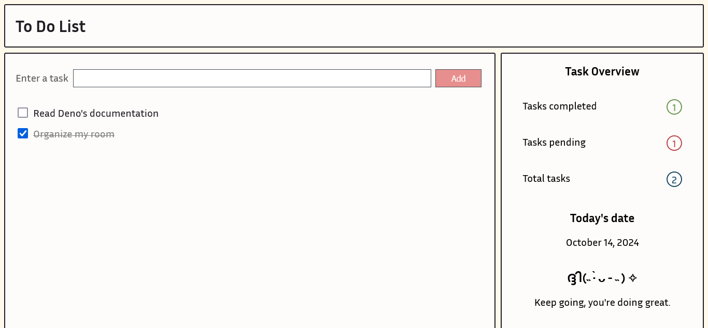

- [x] Simple calculator
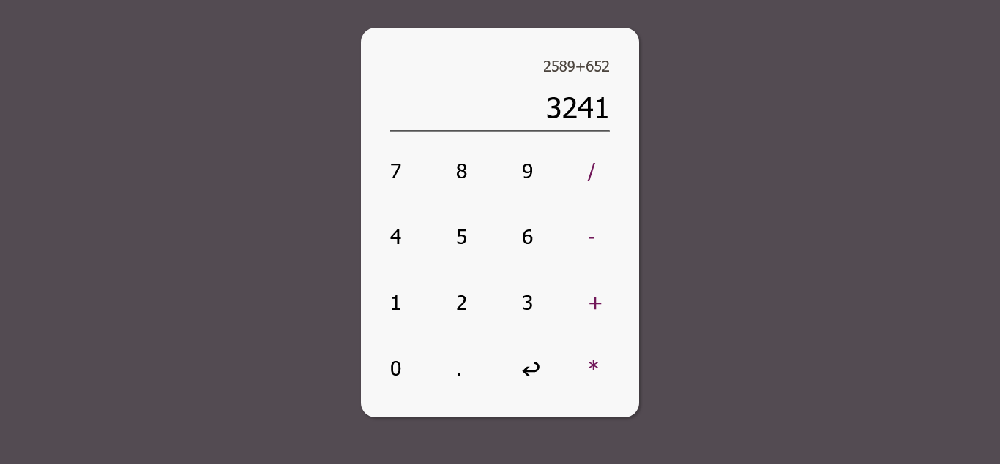

- [x] Image gallery
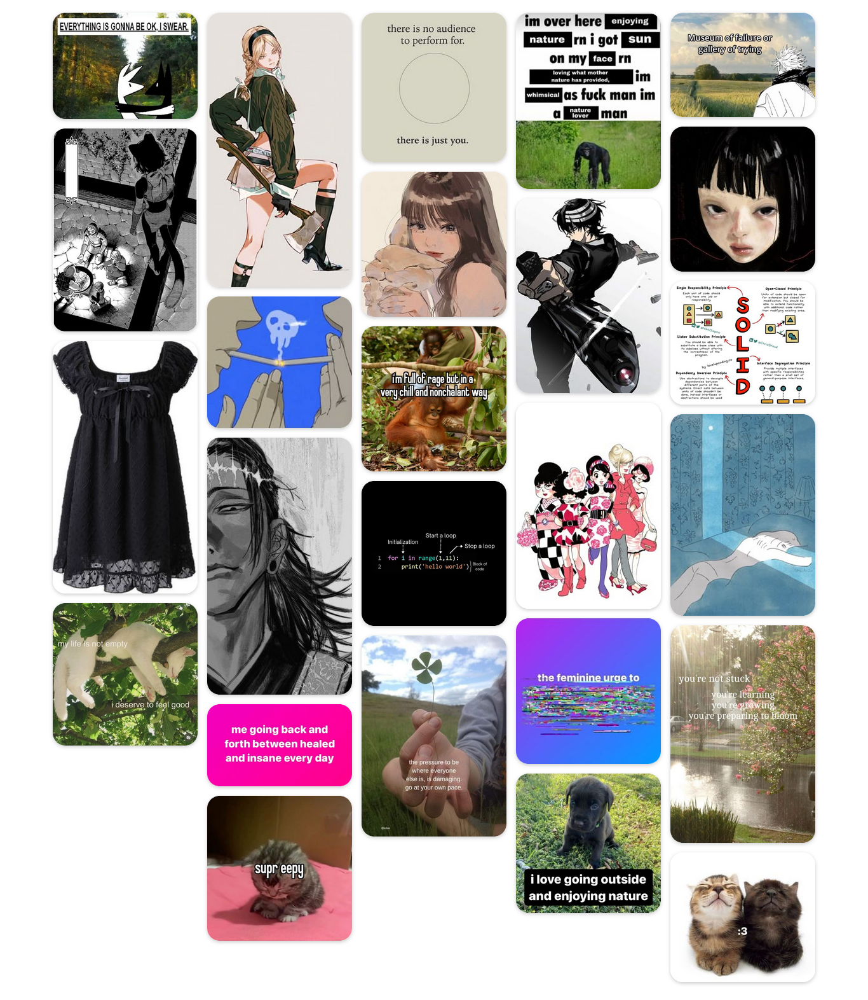

- [ ] Recipe page
- [ ] Number guessing game
- [ ] CSS animation
- [ ] Login page
- [ ] Currency converter
- [ ] Responsive tables
- [ ] Notes application
- [ ] FAQ page
- [ ] Testimonials page
- [ ] Progress bar
- [ ] Weather summary
- [ ] Pop-up
- [x] Portfolio
- [ ] Events page
- [ ] Interactive quiz
- [ ] Parallax effect
- [ ] News page
- [ ] Real-time chat
- [ ] Countdown
- [ ] E-commerce page

---
I decided to do this challenge because I believe that as a frontend developer, I should be able to master simple things like these.  ପ(๑•ᴗ•๑)ଓ ♡ 
